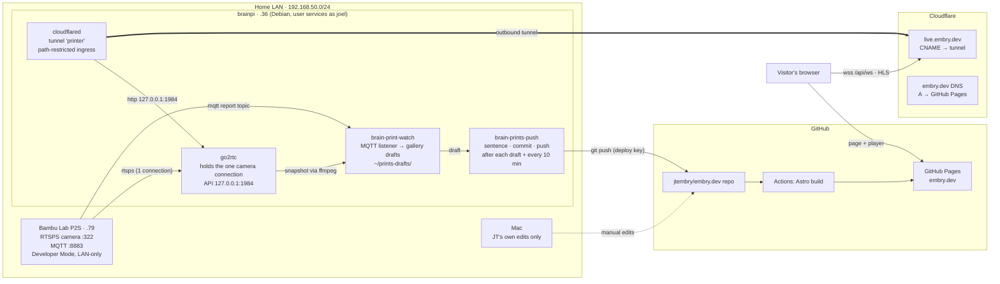
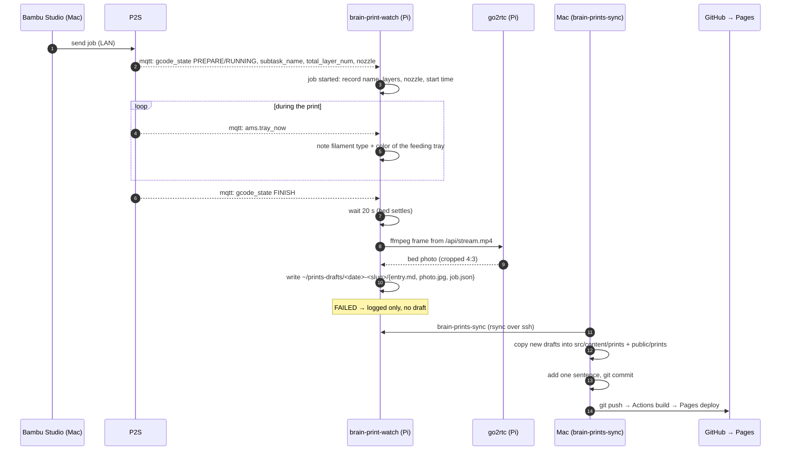
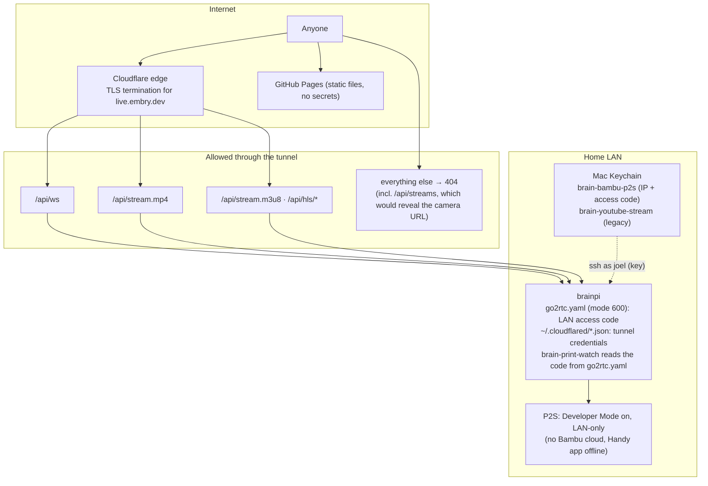

# embry.dev print pipeline: architecture

Four moving parts: the printer, the Pi beside it, Cloudflare in front of the Pi, and the static site on GitHub Pages. The Pi publishes finished prints itself (`brain-prints-push`, deploy key, write access to this repo only); the Mac is no longer involved.

## 1. System overview



## 2. Live feed: one viewer opening /live

```mermaid
sequenceDiagram
  autonumber
  participant V as Browser
  participant PG as GitHub Pages
  participant CF as Cloudflare edge
  participant CD as cloudflared (Pi)
  participant G as go2rtc (Pi)
  participant P as P2S camera

  V->>PG: GET /live
  PG-->>V: page + player script (own MSE client)
  V->>CF: wss://live.embry.dev/api/ws?src=p2s
  CF->>CD: via tunnel (path allowed)
  CD->>G: ws 127.0.0.1:1984/api/ws
  alt first viewer
    G->>P: rtsps://…:322 (the single allowed connection)
    P-->>G: H.264 1080p30
  end
  V->>G: {type: "mse", value: codecs}
  G-->>V: {type: "mse", value: "video/mp4; codecs=avc1…"}
  loop every frame
    G-->>V: fMP4 fragment (binary ws frame)
    V->>V: SourceBuffer.appendBuffer, stay near live edge
  end
  Note over V: iPhone (no MSE): video.src = /api/stream.m3u8 → HLS over the same tunnel
  Note over V,G: Printer asleep → ws closes → idle panel, retry every 30 s
```

## 3. Gallery: from "send print" to a published card



## 4. Trust boundaries and secrets



## Services and where to look

| Where | Service | Purpose | Check |
| --- | --- | --- | --- |
| brainpi | `go2rtc.service` (user) | camera relay | `curl http://127.0.0.1:1984/api/streams?src=p2s` |
| brainpi | `cloudflared.service` (user) | tunnel to live.embry.dev | `systemctl --user status cloudflared` |
| brainpi | `brain-print-watch.service` (user) | job watcher → drafts | `tail ~/prints-drafts/watch.log` |
| Mac | `brain-prints-sync` | pull drafts into the site | `brain-prints-sync --dry-run` |
| GitHub | Actions `Deploy to GitHub Pages` | build + publish on push to main | `gh run list -R jtembry/embry.dev` |

Design decisions: the Pi is the relay because the printer only speaks on the LAN and allows one camera connection; YouTube Live was tried and dropped (no live embeds without AdSense, no automatic restart); the site's player is hand-written because go2rtc's bundled one threw in Edge; the Pi never gets GitHub credentials, so publishing stays a human step on the Mac.
